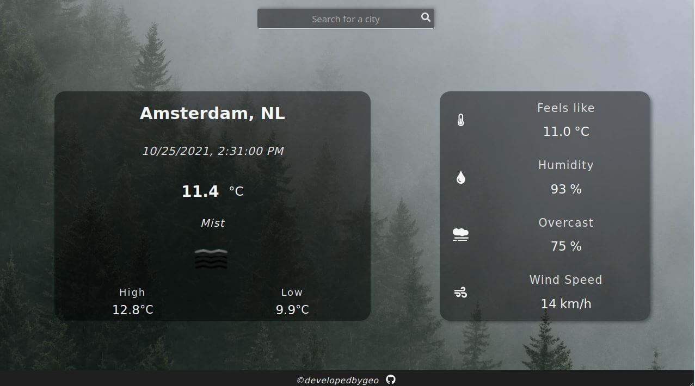

# Weather App



My first weather app, using async / await. Built mobile-first and fully responsive for both portrait and landscape orientation, it fetches data from the OpenWeatherMap API and displays them in two distinct HTML elements. Additionally, before querying the API, the query is validated with the Constraint Validation API, along with custom regex.

## Installation

#### Installing the dependencies:

After cloning, it would be essential to install the dependencies:

```
npm install
```

#### Building the project:

Creating the /dist directory requires building:

```
npm run build
```

#### Running the project on watch mode:

`watch` has also been configured and is run with:

```
npm run watch
```

#### Accessing the API:

It is **very important** to create a _.env_ file with your api key to query the API. For more details about it, please refer to the `.env_sample` file in the root directory.

## Features

- GSAP Animations
- Dynamic background based on the weather conditions
- Field validation

## Tech

- JavaScript
- NPM
- Webpack
- GSAP
- FontAwesome
- dotenv

For a more detailed overview of the development & production dependencies, please check `package.json`.

## Contributing

Contributions are certainly welcome. Please feel free to open an issue/PR if there is something you would like to be changed.

## Acknowledgements

A massive thank you to The Odin Project & freeCodeCamp community, as their guidance and learning process have been invaluable. All of the photos in this project were provided by Unsplash.com

## License

[MIT](./LICENSE.md)
